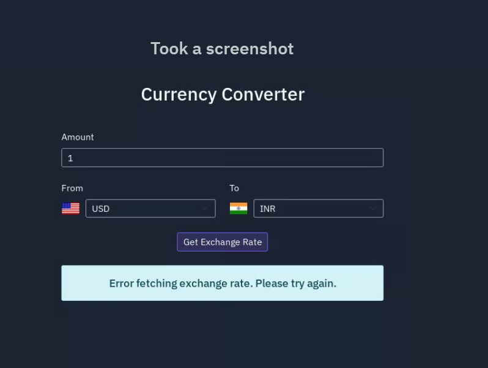

Here's an updated README for your Currency Convertor project:

---

# Currency Convertor

A web application that provides real-time currency exchange rates and historical rate charts using the ExchangeRate API.



## Features

- Real-time currency conversion
- Historical exchange rate charts
- Quick comparison with major currencies
- Responsive design
- Support for multiple currency pairs

## Setup Instructions

1. Clone this repository to your machine:
    ```bash
    git clone https://github.com/sudhirskp/CurrencyConvertor.git
    ```

2. Get an API key from [ExchangeRate API](https://www.exchangerate-api.com/)

3. Set up your API key:
    ```bash
    export EXCHANGERATE_API_KEY=your_api_key_here
    ```

4. Install required packages:
    ```bash
    pip install flask requests
    ```

5. Run the application:
    ```bash
    python main.py
    ```

6. Open your browser and go to `http://0.0.0.0:5000`

## Technologies Used

- JavaScript
- HTML
- Python (Flask)
- CSS
- Nix
- ExchangeRate API

## API Endpoints

- `/api/exchange-rate/<from>/<to>/<amount>` - Get current exchange rate
- `/api/historical-rates/<from>/<to>` - Get historical rates

## Note

Make sure to keep your API key secure and never commit it to version control.

## Demo

You can try out the live demo on Replit [here](https://replit.com/@sudhirskp/CurrencyConverter)

---

Feel free to adjust any part of this draft to better fit your project.
